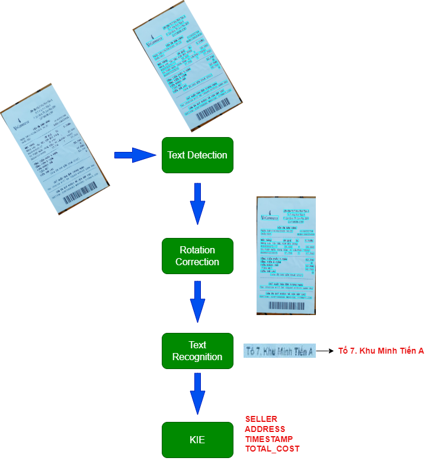
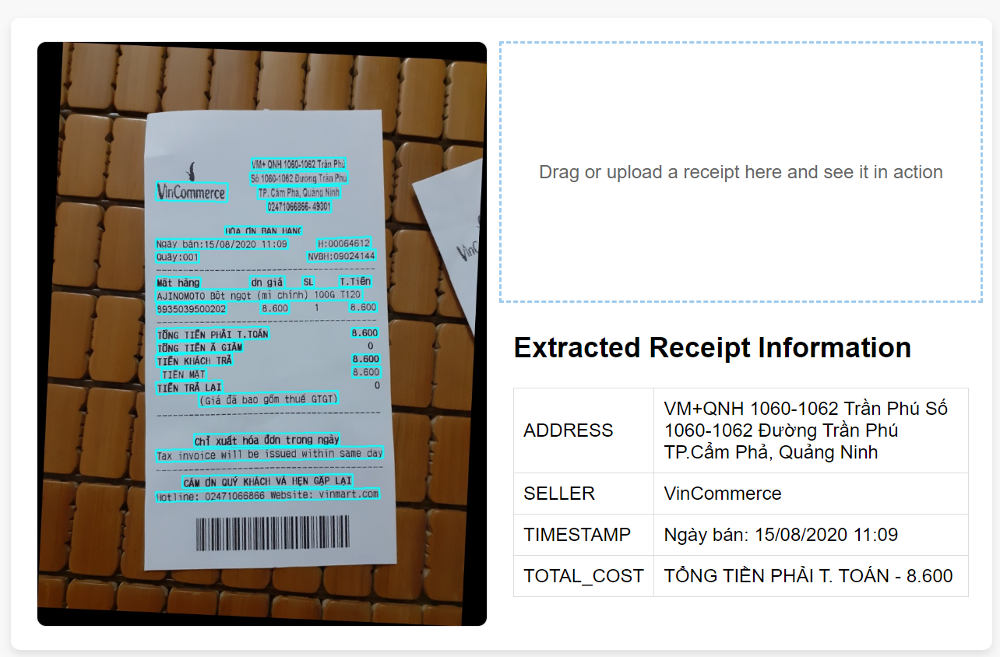

# OCR Receipts
A complete pipeline for extracting and processing information from receipt images using Optical Character Recognition (OCR). This project leverages cutting-edge technologies such as PaddleOCR, VietOCR, and PICK for text detection, recognition, and structured information extraction. A web interface is provided for seamless user interaction.
## 📚Table of Contents
- [Workflow](#workflow)
- [Web Interface](#web-interface)
- [Installation](#installation)

## 🌟 Workflow
The project workflow consists of the following steps:
- **Text Detection**: Accurate detection of text regions using PaddleOCR.
- **Rotation Correction**: Automatic alignment of rotated text using OpenCV and MobileNetv3.
- **Text Recognition**: Recognize text content with VietOCR.
- **Information Extraction**: Extract structured data using PICK.


## 💻 Web Interface


## 🚀 Installation
1. Clone the repository:
```
git clone https://github.com/johnPa02/ocr_receipts.git
cd ocr_receipts
```
2. Install dependencies:
```
pip install -r requirements.txt
```
## 📝 Usage
Start the server:
```
python app.py
```